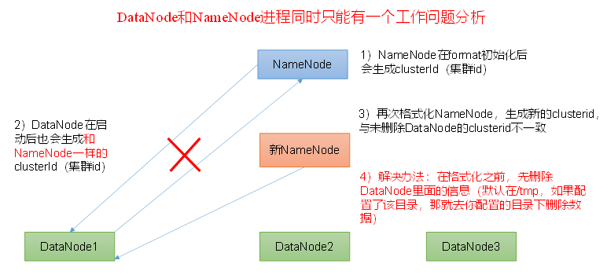

# 常见错误及解决方法

1. 防火墙没有关闭或者没有启动YARN

   INFO client.RMProxy: Connecting to ResourceManager at hadoop108/192.168.10.108:8032

2. 主机名称配置错误

3. IP地址配置错误

4. ssh没有配置好

5. root用户和atguigu两个用户启动集群不统一

6. 配置文件修改不细心

7. 不识别主机名称

   ```
   java.net.UnknownHostException: hadoop102: hadoop102
           at java.net.InetAddress.getLocalHost(InetAddress.java:1475)
           at org.apache.hadoop.mapreduce.JobSubmitter.submitJobInternal(JobSubmitter.java:146)
           at org.apache.hadoop.mapreduce.Job$10.run(Job.java:1290)
           at org.apache.hadoop.mapreduce.Job$10.run(Job.java:1287)
           at java.security.AccessController.doPrivileged(Native Method)
   at javax.security.auth.Subject.doAs(Subject.java:415)
   ```

   解决方法：

   1. 在/etc/hosts文件中添加192.168.10.102 hadoop102
   2. 主机名称不要起hadoop hadoop000等特殊名称

8. DataNode和NameNode进程同时只能工作一个。



9. jps发现进程已经没有，但是重新启动集群，提示进程已经开启。

   原因是在Linux的根目录下/tmp目录中存在启动的进程临时文件，将集群相关进程删除掉，再重新启动集群。

10. jps不生效

    原因：全局变量hadoop java没有生效。解决办法：需要source /etc/profile文件。